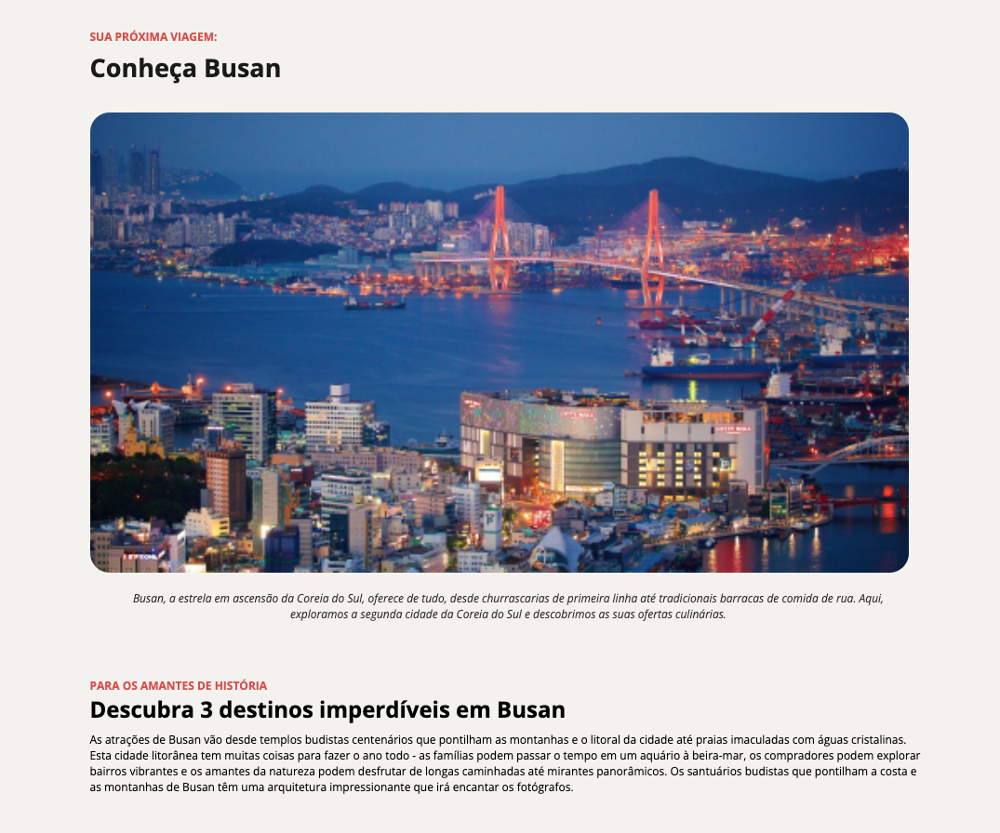

# Local Turístico - Busan



## 📍 Sobre o Projeto

Este é um projeto de página web promocional que apresenta **Busan, Coreia do Sul** como destino turístico. A página destaca a beleza noturna da cidade, suas atrações culturais e gastronômicas, oferecendo uma experiência visual imersiva para potenciais viajantes.

## ✨ Características

- **Design Moderno**: Interface limpa e responsiva
- **Imagens de Alta Qualidade**: Fotografias panorâmicas de Busan
- **Conteúdo Informativo**: Descrições detalhadas sobre atrações turísticas
- **Foco Gastronômico**: Destaque para a culinária local
- **Atrações Históricas**: Informações sobre templos budistas e pontos turísticos

## 🛠️ Tecnologias Utilizadas

- **HTML5**: Estrutura semântica
- **CSS3**: Estilização moderna e responsiva
- **Design Responsivo**: Adaptável a diferentes dispositivos

## 🚀 Como Usar

1. Clone o repositório:

```bash
git clone https://github.com/rafaelrhp/local-turistico.git
```

2. Abra o arquivo `index.html` no seu navegador

3. Ou acesse diretamente: [https://rafaelrhp.github.io/local-turistico/](https://rafaelrhp.github.io/local-turistico/)

## 📱 Visualização

Acesse o projeto online: **[Local Turístico - Busan](https://rafaelrhp.github.io/local-turistico/)**

## 🎯 Funcionalidades

- **Seção Principal**: Apresentação visual de Busan com fotografia noturna
- **Descrição Gastronômica**: Informações sobre a culinária local
- **Atrações Históricas**: Destaque para templos budistas e pontos turísticos
- **Design Responsivo**: Funciona em desktop, tablet e mobile

## 📸 Imagens do Projeto

O projeto inclui imagens de alta qualidade de Busan, incluindo:

- Vista noturna da cidade
- Pontos turísticos
- Elementos visuais complementares

## 🤝 Contribuição

Contribuições são bem-vindas! Sinta-se à vontade para:

- Reportar bugs
- Sugerir melhorias
- Adicionar novos destinos turísticos

## 📄 Licença

Este projeto está sob a licença MIT. Veja o arquivo `LICENSE` para mais detalhes.

---

**Desenvolvido com ❤️ por Rafael**
